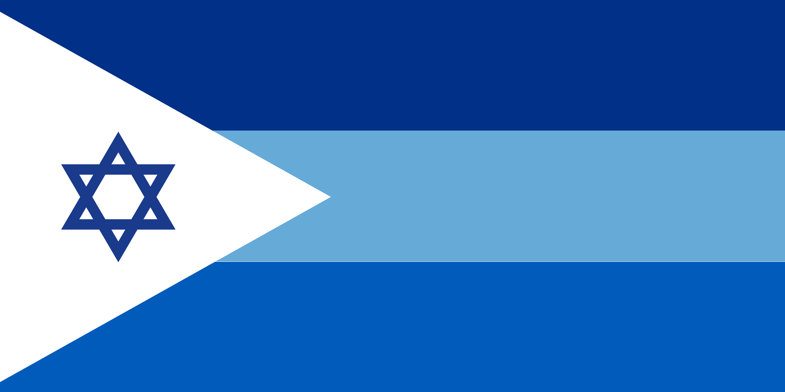

# カナアン島共和国 - 国家設定

カナアン島共和国（State of Canaan）の基本設定をここに記録する。

## 国家概要

| 項目 | 設定内容 |
| :--- | :--- |
| **国名** | カナアン島共和国 (State of Canaan) |
| **国コード**| SOC |
| **建国年** | 1949年（独立武装蜂起による） |
| **国土** | 東地中海（キプロス南部、イスラエル・エジプト沖の島） |
| **政治体制** | 民主国家 / ユダヤ人国家 / ユダヤ教国家 |
| **人口** | 少数精鋭 |
| **公用語** | イスラエル語 |
| **主要産業・強み** | 高度な海軍技術 |
| **外交関係** | アメリカ合衆国、イスラエル国の友好国（同盟国） |

## 国旗

